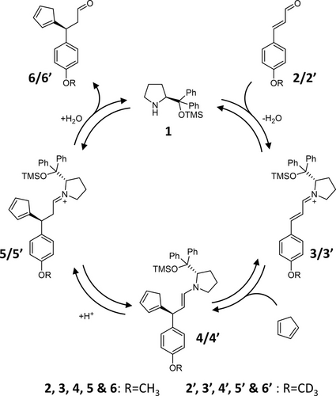
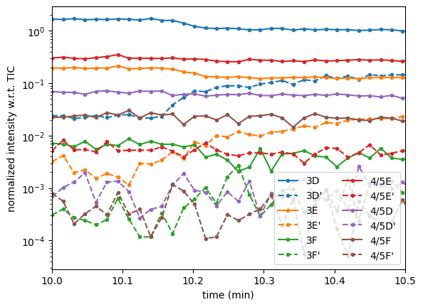
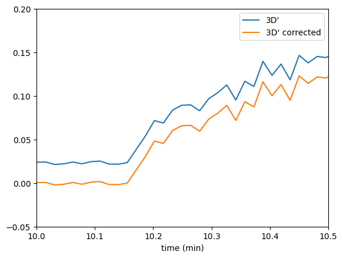
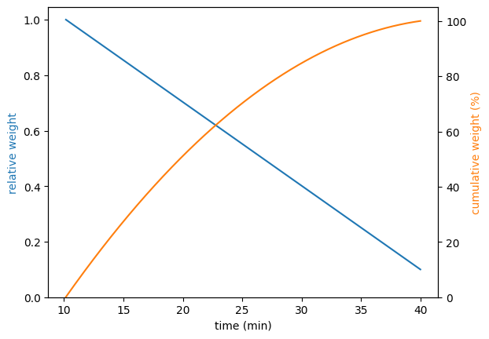
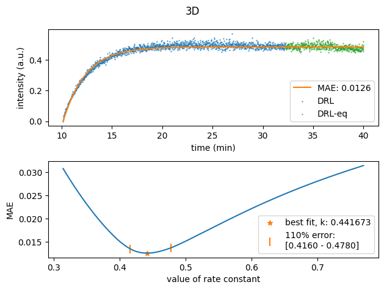
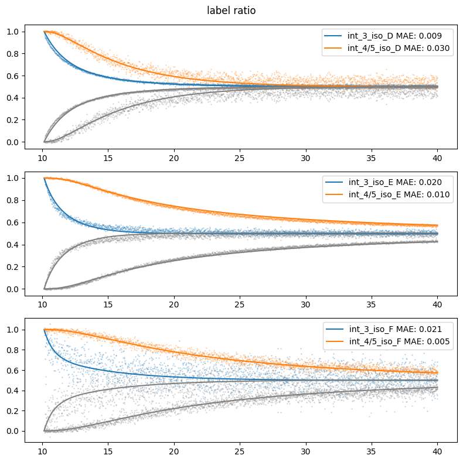
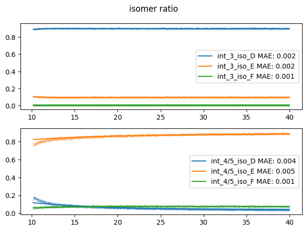
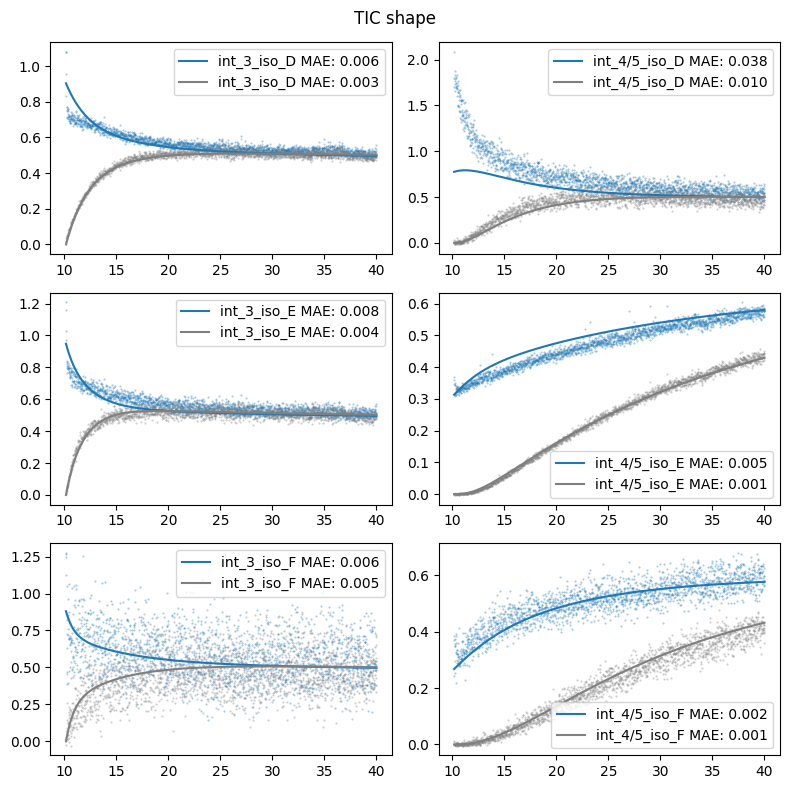

Extensive example
=================

Roelant et al. (`link <https://onlinelibrary.wiley.com/doi/full/10.1002/anie.202205720>`_, `DOI: doi/10.1002/anie.202205720`)
used DRL to analyze a reaction with the following mechanism:

There are 3 isomers per intermediate in this reaction:

.. image:: images/extensive_example_roelant_isomers.jpeg
    :width: 800
    :align: center

Below I will describe how we can analyze their data using the delayed_reactant_labeling module. However, to make the
analysis easier we have changed the naming convention. The major pathway 3C -> 4B -> 5B -> R6 and minor pathway
3B -> 4C -> 5C -> S6 is quite confusing as the label of the isomer changes for the same pathway. Therefore all chemicals
in the major pathway have been labeled with "D", and in the minor pathway with "E". All chemical in the side pathway
"A" have been labeled "F". The data adjusted for this naming convention, and with time array extending for the
data pre-addition of the labeled compound can be found on `github <https://github.com/MartijnDingemans/delayed_reactant_labeling/tree/5a06b113895e3c8b324220486a59d7510bd77bf1/examples>`_.

Experimental data
-----------------

First we import the required modules, and show the original data around the time that the labeled compound has been added

.. code-block:: python

    from copy import deepcopy
    import numpy as np
    import pandas as pd
    import matplotlib.pyplot as plt
    import warnings

    from scipy.optimize import minimize, Bounds
    from delayed_reactant_labeling.optimize import RateConstantOptimizerTemplate
    from delayed_reactant_labeling.predict import DRL

    experimental_complete = pd.read_excel('experimental_data_Roelant.xlsx', engine='openpyxl')
    LABEL = "'"  # single ' will was used for labeled reactants. To keep the code general, we will use LABEL instead.

    fig, ax = plt.subplots()
    n = 0
    for col in experimental_complete.columns:
        if col == 'time (min)' or col[-len(LABEL):] == LABEL:
            continue
        ax.plot(experimental_complete['time (min)'], experimental_complete[col], linestyle='-', marker='.', label=col, color=f'C{n}')
        ax.plot(experimental_complete['time (min)'], experimental_complete[f'{col}{LABEL}'], linestyle='--', marker='.', label=f'{col}{LABEL}', color=f'C{n}')
        n += 1

    ax.legend(ncol=2)
    ax.set_ylabel('normalized intensity w.r.t. TIC')
    ax.set_xlabel('time (min)')
    ax.set_xlim(10, 10.5)
    ax.set_yscale('log')
    fig.show()

We can clearly see that around 10.15 minutes the intensity of 3D increases rapidly. Therefore, this seems like a good
t0. Furthermore we see that many of the labeled compounds (dashed lines) have intensities before the chemicals should
be present. We can correct our data according for these two factors as follows:

.. code-block:: python

    ax = experimental_complete.plot('time (min)', f'3D{LABEL}')

    TIME_LABELED_ADDITION = 10.15
    index_labeled_addition = np.argmax(np.array(experimental_complete['time (min)'] > TIME_LABELED_ADDITION))  # select first true value
    for col in experimental_complete.columns:  # correct for noise by removing the median
        if col == 'time (min)' or col[-len(LABEL):] != LABEL:
            continue
        experimental_complete.loc[:, col] = experimental_complete.loc[:, col] \
            - experimental_complete.loc[index_labeled_addition-10:index_labeled_addition, col].median()

    experimental_complete.plot('time (min)', f'3D{LABEL}', ax=ax, label=f'3D{LABEL} corrected')
    ax.set_xlim(10, 10.5)
    ax.set_ylim(-0.05, 0.2)
    ax.figure.show()

    time_pre = experimental_complete.loc[:index_labeled_addition, 'time (min)'].to_numpy()  # pre addition
    experimental = experimental_complete.loc[index_labeled_addition:, :]
    time = experimental['time (min)'].to_numpy()

Defining the error metric
-------------------------

For the typical DRL experiment, the focus is on the initial part of the curve, as this is where the largest changes occur.
When we optimize the model, we can weigh these initial parts more heavily than others.
Below a function, or combination of functions, can be given which will construct the weight of each datapoint.
Furthermore, the type of error (MAE, MAPE, RMSE) can be defined here.

.. code-block:: python

    WEIGHT_TIME = 1 - 0.9 * np.linspace(0, 1, time.shape[0])  # decrease weight with time, first point 10 times as import as last point
    WEIGHT_TIME = WEIGHT_TIME / sum(WEIGHT_TIME)  # normalize

    def METRIC(y_true: np.ndarray, y_pred: np.ndarray) -> float:
        return np.average(np.abs(y_pred - y_true), weights=WEIGHT_TIME, axis=0)

    fig, ax = plt.subplots()
    ax.set_xlabel('time (min)')
    ax.plot(time, WEIGHT_TIME / max(WEIGHT_TIME), color='C0')
    ax.set_ylabel('relative weight', color='C0')
    ax.set_ylim(bottom=0)
    ax2 = ax.twinx()
    ax2.plot(time, WEIGHT_TIME.cumsum() * 100, color='C1')
    ax2.set_ylabel('cumulative weight (%)', color='C1')
    ax2.set_ylim(bottom=0)
    fig.show()

Utilizing normal kinetics
-------------------------

If a chemical in the system has reached equilibrium before the end of the measurement, the steady state assumption is
valid. In some scenarios this allows us to extract the rate constant corresponding to that reaction, using
regular kinetics. In this reaction the rate of change for intermediate :math:`3` can be described by:

.. math::
    :label: d3dt

    d[3]/dt = k_1[cat][2] + k_{-2}[4] - (k_{-1} + k_2)[3]

When :math:`3` is in steady state conditions, equation :eq:`d3dt` equals 0, and we can restructure it to:

.. math::
    :label: 3eq

    k_1[cat][2] + k_{-2}[4] = (k_{-1} + k_2)[3]_{eq}

If the system is perturbed by e.g. the addition of a labeled compound, the rate of change is again given by :eq:`d3dt`.
We can substitute :eq:`3eq` into :eq:`d3dt`:

.. math::
    :label: yes

    d[3]/dt = (k_{-1} + k_2)[3]_{eq} - (k_{-1} + k_2)[3] = (k_{-1} + k_2)\cdot([3]_{eq} - [3])

which can be solved analytically. However this substitution is only valid if :math:`4` has a constant concentration or
:math:`k_{-2}\cdot4` is negligible. The solution to this system, when normalized such that 3 + 3-labeled = 1 at equilibrium,
is given by:

.. math::
    :label: 3t

    [3]_t = [3]_{eq} \cdot (1 - e^{-(k_{-1} + k_2) \cdot t})

Roelant et al. performed kinetic experiments that showed that :math:`k_{-1}` equals 0, and therefore we can straight
up extract :math:`k_2` from :eq:`3t`. In code this is done as follows:

.. code-block:: python

    STEADY_STATE_CHEMICALS = ['3D', '3E', '3F']
    EQUILIBRIUM_LAST_N = 500

    for chemical in STEADY_STATE_CHEMICALS:
        # normalize for each steady state such that chemical + chemical' = 1 at equilibrium
        y_true_curve = experimental[f'{chemical}{LABEL}'] / experimental.loc[-EQUILIBRIUM_LAST_N:, [chemical, f'{chemical}{LABEL}']].sum(axis=1).mean()
        f = lambda k: y_true_curve.iloc[-EQUILIBRIUM_LAST_N:].mean() * (1 - np.exp( -k * (time - time[0])))
        MAE_f = lambda x: METRIC(y_true=y_true_curve, y_pred=f(x))

        result = minimize(MAE_f, x0=np.array([1]))
        if not result.success: print(chemical, result.message)

        # show best fit
        fig, axs = plt.subplots(2, 1)
        fig.suptitle(chemical)
        ax = axs[0]
        ax.plot(time, f(result.x[0]), label=f'MAE: {result.fun:.4f}', color='tab:orange')
        ax.scatter(time[:-EQUILIBRIUM_LAST_N], y_true_curve[:-EQUILIBRIUM_LAST_N],s=1, marker='.', color='tab:blue', label='DRL')
        ax.scatter(time[-EQUILIBRIUM_LAST_N:], y_true_curve[-EQUILIBRIUM_LAST_N:],s=1, marker='.', color='tab:green', label='DRL-eq')
        ax.set_xlabel('time (min)')
        ax.set_ylabel('intensity (a.u.)')
        ax.legend()

        # analyze sensitivity to deviations
        rates = np.linspace(0, 5*result.x[0], num=500)
        errors = np.array([MAE_f(x) for x in rates])
        ind = errors < 2.5*result.fun
        ax = axs[1]
        ax.plot(rates[ind], errors[ind])
        ax.scatter(result.x[0], result.fun, label=f'best fit, k: {result.x[0]:.6f}', marker='*', color='tab:orange')
        bounds_10pc = np.where(errors<1.1*result.fun)[0][[0, -1]]
        ax.scatter(rates[bounds_10pc], errors[bounds_10pc], marker='|', color='tab:orange', s=100,
                   label=f'110% error:\n[{rates[bounds_10pc[0]]:.4f} - {rates[bounds_10pc[1]]:.4f}]')
        ax.set_xlabel('value of rate constant')
        ax.set_ylabel('MAE')
        ax.legend()
        fig.show()

Similar graphs were made for E and F, although the noise in F specifically allowed for a large range of values in which
the rate constant yielded an acceptable error. The found range where the error was 110% for 3E was [0.675 - 0.934],
and for 3F [0.242 - 1.228].

Defining the model
------------------

The chemical system can be described by the following reaction steps. The chemicals that have a labeled counterpart
are marked with {label} such that we do not have to write it out twice. We than loop over each reaction and create
its backwards reaction.

.. code-block:: python

    REACTIONS_ONEWAY = []
    for label in ["", LABEL]:
        REACTIONS_ONEWAY.extend([
            ("k1_D", ["cat", f"2{label}", ], [f"3D{label}", ]),
            ("k1_E", ["cat", f"2{label}", ], [f"3E{label}", ]),
            ("k1_F", ["cat", f"2{label}", ], [f"3F{label}", ]),

            ("k2_D", [f"3D{label}", ], [f"4D{label}", ]),
            ("k2_E", [f"3E{label}", ], [f"4E{label}", ]),
            ("k2_F", [f"3F{label}", ], [f"4F{label}", ]),

            ("k3_D", [f"4D{label}", ], [f"5D{label}", ]),
            ("k3_E", [f"4E{label}", ], [f"5E{label}", ]),
            ("k3_F", [f"4F{label}", ], [f"5F{label}", ]),

            ("k4_D", [f"5D{label}", ], [f"6D{label}", "cat", ]),
            ("k4_E", [f"5E{label}", ], [f"6E{label}", "cat", ]),
            ("k4_F", [f"5F{label}", ], [f"6F{label}", "cat", ]),
        ])

    reactions = deepcopy(REACTIONS_ONEWAY)
    for k, reactants, products in REACTIONS_ONEWAY:
        reactions.append(("k-" + k[1:], products, reactants))
    rate_constant_names = sorted(set([k for k, _, _ in reactions]))

    # these groups will make the analysis easier
    ISOMERS = ["D", "E", "F"]
    INTERMEDIATES = ["3", "4/5"]

The next step is to the create our RateConstantOptimizer class. We will apply three different kinds of error metrics.

1. label ratio: The ratio of e.g. 3D / (3D+3D'), the typical DRL curve.
2. isomer ratio: The ratio of e.g. 3D / (3D + 3E + 3F).
3. TIC shape: how well the curve represent the shape of the TIC curve.

We will apply weights to each type of error to make sure that the system prioritizes getting the label ratio right, but
would see it as a benefit if the isomer ratio also fits well. In the optimized model the three different kinds of error
are relatively similar to each other in the contribution to the total error. The weight of all isomers F has been
drastically decreased because of the large amount of noise in this data.

.. code-block:: python

    from __future__ import annotations
    WEIGHTS = {
        "label_": 1,
        "isomer_": 0.5,
        "TIC": 0.2,
        "iso_F": 0.25,
    }
    # By putting it outside the function, we can store in the metadata of each optimization process.
    CONCENTRATIONS_INITIAL = {"cat": 0.005 * 40 / 1200,  # concentration in M
                              "2": 0.005 * 800 / 1200}
    CONCENTRATION_LABELED_REACTANT = {"2'": 0.005 * 800 / 2000}
    DILUTION_FACTOR = 1200 / 2000

    class RateConstantOptimizer(RateConstantOptimizerTemplate):
        @staticmethod
        def create_prediction(x: np.ndarray, x_description: list[str]) -> pd.DataFrame:
            # separate out the ionization factor from the other parameters which are being optimized.
            rate_constants = pd.Series(x[:len(rate_constant_names)], index=x_description[:len(rate_constant_names)])
            ionization_factor = x[-1]

            drl = DRL(reactions=reactions,
                      rate_constants=rate_constants,
                      verbose=False)

            prediction_labeled = drl.predict_concentration(
                t_eval_pre=time_pre,
                t_eval_post=time,
                initial_concentrations=CONCENTRATIONS_INITIAL,
                labeled_concentration=CONCENTRATION_LABELED_REACTANT,
                dilution_factor=DILUTION_FACTOR,
                rtol=1e-8,
                atol=1e-8)

            # SYSTEM-SPECIFIC ENAMINE IONIZATION CORRECTION -> only a prediction of 4 and 5 together can be made!
            # this because the unstable enamine will ionize to the iminium ion upon injection in the mass spectrometer.
            for isomer in ISOMERS:
                for label in ["", "'"]:
                    prediction_labeled.loc[:, f"4/5{isomer}{label}"] = prediction_labeled.loc[:, f"5{isomer}{label}"] \
                        + ionization_factor * prediction_labeled.loc[:, f"4{isomer}{label}"]

            return prediction_labeled

        @staticmethod
        def calculate_curves(data: pd.DataFrame) -> dict[str, np.ndarray]:
            curves = {}
            for intermediate in INTERMEDIATES:
                # sum does not have to be recalculated between the isomer runs
                sum_all_isomers = data[[f'{intermediate}{isomer}' for isomer in ISOMERS]].sum(axis=1)
                for isomer in ISOMERS:
                    chemical = f"{intermediate}{isomer}"  # 3D, 3E, 3F, 4/5D, 4/5E, 3/5F
                    chemical_iso_split = f"int_{intermediate}_iso_{isomer}"  # allows for easy modification of weight. str.contains('int_1') is much more specific than just '1'

                    sum_chemical = data[[chemical, f"{chemical}'"]].sum(axis=1)

                    curves[f"label_{chemical_iso_split}"] = (  # 3D / (3D+3D')
                        data[chemical] / sum_chemical).to_numpy()
                    curves[f"isomer_{chemical_iso_split}"] = (  # 3D / (3D+3E+3F)
                        data[chemical] / sum_all_isomers).to_numpy()
                    curves[f"TIC_{chemical_iso_split}"] = (  # normalized TIC curve
                            data[chemical] / sum_chemical.iloc[-100:].mean()).to_numpy()
                    curves[f"TIC_{chemical_iso_split}'"] = (  # normalized TIC curve
                            data[f"{chemical}'"] / sum_chemical.iloc[-100:].mean()).to_numpy()
            return curves

        def weigh_errors(self, errors: pd.Series) -> pd.Series:
            weighed_errors = super().weigh_errors(errors)

            # perform the usual behavior of this function, but also perform an additional check with regards to the output!
            TIC_sum = weighed_errors[weighed_errors.index.str.contains("TIC_")].sum()
            label_sum = weighed_errors[weighed_errors.index.str.contains("label_")].sum()
            isomer_sum = weighed_errors[weighed_errors.index.str.contains("isomer_")].sum()
            total = TIC_sum + label_sum + isomer_sum
            ratios = pd.Series([TIC_sum/total, label_sum/total, isomer_sum/total], index=['TIC', 'label', 'total'])
            if any(ratios < 0.05) or any(ratios > 0.95):
                warnings.warn(f'One of the error metrics is either way smaller, or way larger than the others\n{ratios}')

            return weighed_errors

    RCO = RateConstantOptimizer(experimental=experimental, metric=METRIC, raw_weights=WEIGHTS)

Optimizing the model
--------------------
To optimize the model we need to first define the bounds and starting position of the system.

.. code-block:: python

    dimension_descriptions = list(rate_constant_names) + ["ion"]
    constraints = pd.DataFrame(np.full((len(dimension_descriptions), 3), np.nan),
                               columns=["vertex", "lower", "upper"],
                               index=dimension_descriptions)

    index_reverse_reaction = constraints.index.str.contains("k-")
    constraints.iloc[np.nonzero(~index_reverse_reaction)] = [1, 1e-9, 1e2]  # forwards; vertex, lower, upper
    constraints.iloc[np.nonzero(index_reverse_reaction)] = [0.5, 0, 1e2]    # backwards
    # newer versions of pandas could also use:
    # constraints[~index_reverse_reaction] = [1, 1e-9, 1e2]

    # special case
    constraints.iloc[np.nonzero(constraints.index.str.contains("ion"))] = [0.01, 1e-6, 1]

    constraints.iloc[np.nonzero(constraints.index.str.contains("k2_D"))] = [0.441673, 0.4160, 0.4780]
    constraints.iloc[np.nonzero(constraints.index.str.contains("k2_E"))] = [0.782919, 0.6747, 0.9335]
    constraints.iloc[np.nonzero(constraints.index.str.contains("k2_F"))] = [0.464105, 0.2418, 1.2277]

    # either chemically or experimentally determined to be zero
    constraints.iloc[np.nonzero(constraints.index.str.contains("k-1"))] = [0, 0, 0]
    constraints.iloc[np.nonzero(constraints.index.str.contains("k-3"))] = [0, 0, 0]
    constraints.iloc[np.nonzero(constraints.index.str.contains("k-4"))] = [0, 0, 0]
    vertex = constraints["vertex"].to_numpy()
    bounds = Bounds(constraints['lower'].to_numpy(), constraints['upper'].to_numpy())

We can than optimize the system once like this:

.. code-block:: python

    path = './optimization/'
    RCO.optimize(
        x0=vertex,
        x_description=dimension_descriptions,
        x_bounds=bounds,
        path=path,
        maxiter=50000,  # this might take a while! 34378 iterations on my machine in 17 minutes
    )

Or multiple times:

.. code-block:: python

    RCO.optimize_multiple(
        path='./optimization_multiple/',
        n_runs=42,
        x_description=dimension_descriptions,
        x_bounds=bounds,
        maxiter=200,
        n_jobs=-2,  # uses all but 1 cpu cores available
    )

Visualize
---------
We can visualize the curves that are used for the caluclation of the error as follows:

.. code-block:: python

    fig_label, axs_label = plt.subplots(3, 1, tight_layout=True, figsize=(8, 8), squeeze=False)
    fig_label.suptitle('label ratio')
    fig_isomer, axs_isomer = plt.subplots(2, 1, tight_layout=True, squeeze=False)
    fig_isomer.suptitle('isomer ratio')
    fig_TIC, axs_TIC = plt.subplots(3, 2, tight_layout=True, figsize=(8, 8), squeeze=False)
    fig_TIC.suptitle('TIC shape')
    marker_settings = {"alpha": 0.4, "marker": ".", "s": 1}

    model = RCO.load_optimized_model(path)

    best_prediction: pd.DataFrame = RCO.create_prediction(model.optimal_x, model.x_description)

    true = RCO.experimental_curves
    pred = RCO.calculate_curves(best_prediction)

    errors = RCO.weigh_errors(RCO.calculate_errors(best_prediction))

    for i, intermediate in enumerate(INTERMEDIATES):
        # sum does not have to be recalculated between the isomer runs
        sum_all_isomers = best_prediction[[intermediate+isomer for isomer in ISOMERS]].sum(axis=1)
        for j, isomer in enumerate(ISOMERS):
            # the "iso_" prefix is given to each chemical so that we can search the strings for e.g. "iso_A" and not get a match for label
            chemical_iso_split = f"int_{intermediate}_iso_{isomer}"

            # plot label ratio
            axs_label[j, 0].plot(time, pred[f"label_{chemical_iso_split}"], color=f"C{i}", label=f"{chemical_iso_split} MAE: {errors[f'label_{chemical_iso_split}']:.3f}")
            axs_label[j, 0].scatter(time, true[f"label_{chemical_iso_split}"], color=f"C{i}", **marker_settings)
            # the curve of the labeled compound is the same, by definition, as 1 - unlabeled
            axs_label[j, 0].plot(time, 1-pred[f"label_{chemical_iso_split}"], color="tab:gray")
            axs_label[j, 0].scatter(time, 1-true[f"label_{chemical_iso_split}"], color="tab:gray", **marker_settings)

            # isomer ratio
            axs_isomer[i, 0].plot(time, pred[f"isomer_{chemical_iso_split}"], label=f"{chemical_iso_split} MAE: {errors[f'isomer_{chemical_iso_split}']:.3f}")
            axs_isomer[i, 0].scatter(time, RCO.experimental_curves[f"isomer_{chemical_iso_split}"], **marker_settings)

            # TIC shape
            axs_TIC[j, i].plot(time, pred[f"TIC_{chemical_iso_split}"],
                               color="tab:blue", label=f"{chemical_iso_split} MAE: {errors[f'TIC_{chemical_iso_split}']:.3f}")
            axs_TIC[j, i].scatter(time, RCO.experimental_curves[f"TIC_{chemical_iso_split}"], color="tab:blue", **marker_settings)

            axs_TIC[j, i].plot(time, pred[f"TIC_{chemical_iso_split}'"],
                               color="tab:gray", label=f"""{chemical_iso_split} MAE: {errors[f"TIC_{chemical_iso_split}'"]:.3f}""")
            axs_TIC[j, i].scatter(time, RCO.experimental_curves[f"TIC_{chemical_iso_split}'"], color="tab:gray", **marker_settings)

    for ax in np.concatenate([axs_label.flatten(), axs_isomer.flatten(), axs_TIC.flatten()]):
        ax.legend()

    fig_label.show()
    fig_isomer.show()
    fig_TIC.show()

