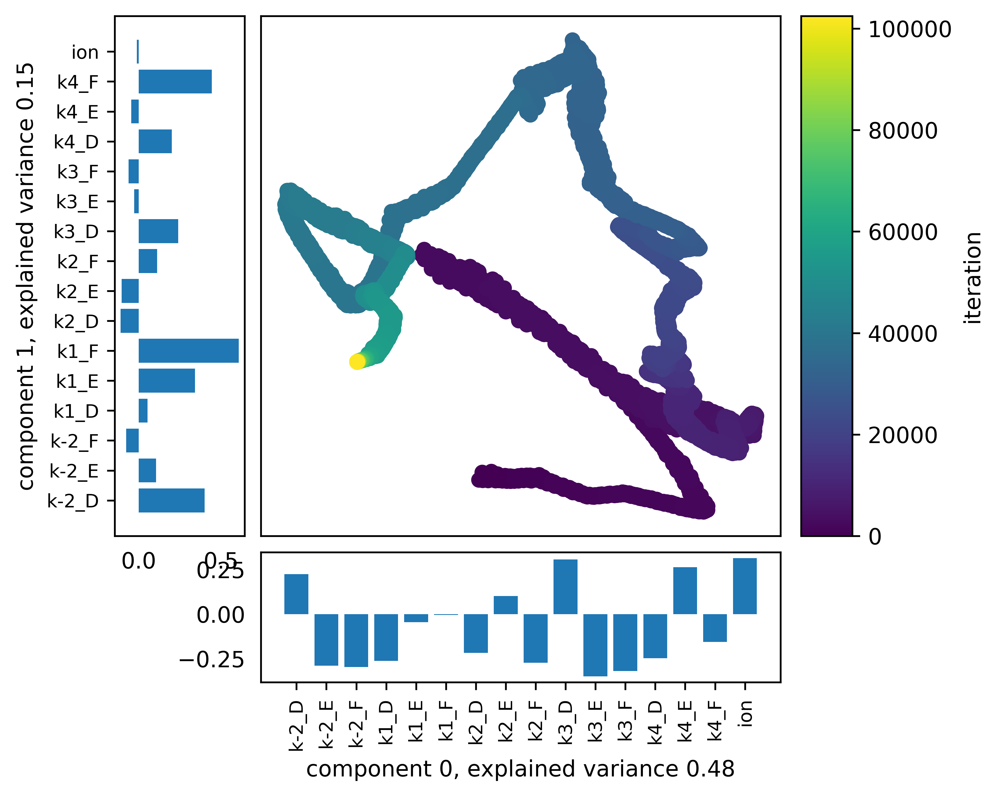
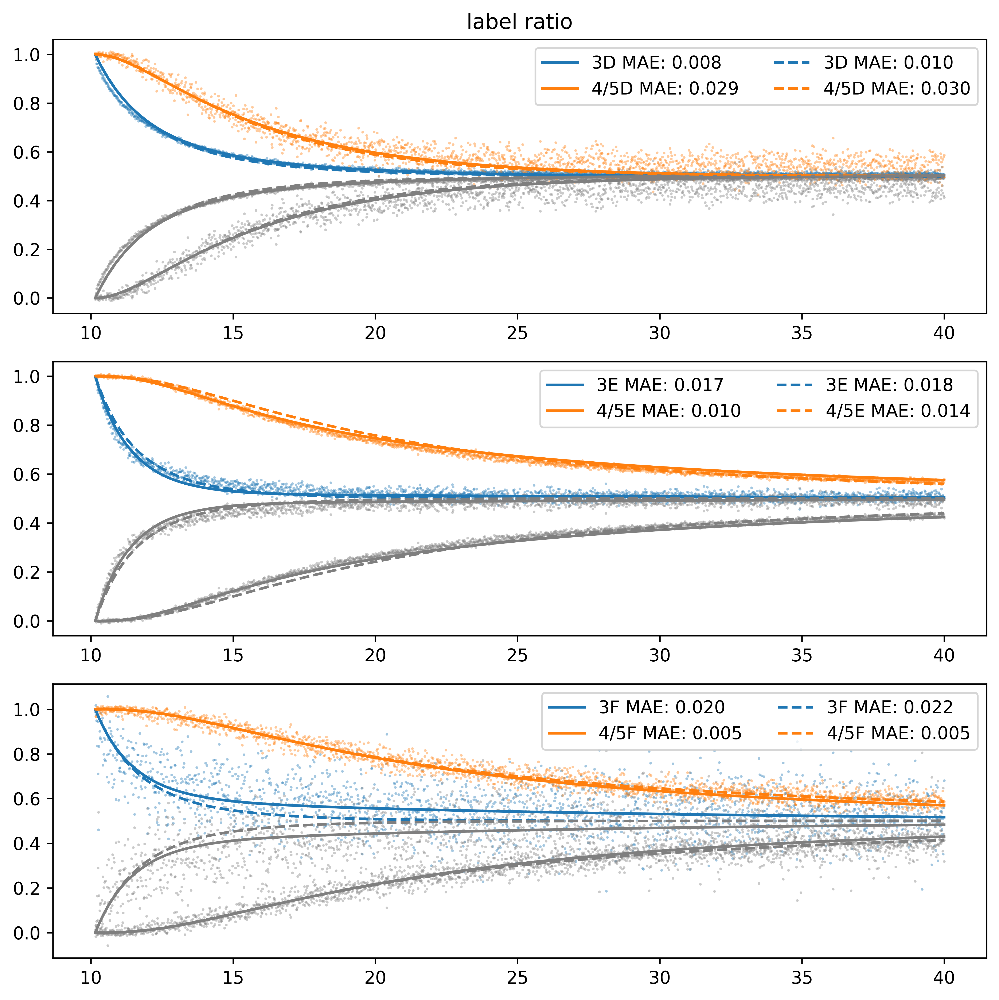
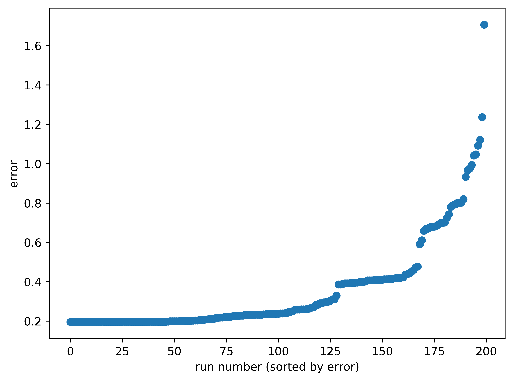

Extensive example
=================

Hilgers et al. (`link <https://onlinelibrary.wiley.com/doi/full/10.1002/anie.202205720>`_, `DOI: doi/10.1002/anie.202205720`)
used DRL to analyze a reaction with the following mechanism:

There are 3 isomers per intermediate in this reaction:

.. image:: images/extensive_example/Hilgers_isomers.jpeg
    :width: 800
    :align: center

Below I will describe how we can analyze their data using the delayed_reactant_labeling module. However, to make the
analysis easier we have changed the naming convention. The major pathway ``3C -> 4B -> 5B -> R6`` and minor pathway
``3B -> 4C -> 5C -> S6`` is quite confusing as the label of the isomer changes for the same pathway. Therefore all intermediates
in the major pathway have been labeled with "D", and in the minor pathway with "E". All intermediates in the side pathway
"A" have been labeled "F". The data adjusted for this naming convention, and with time array extending for the
data pre-addition of the labeled compound can be found on `github <https://github.com/MartijnDingemans/delayed_reactant_labeling/tree/5a06b113895e3c8b324220486a59d7510bd77bf1/examples>`_.

Experimental data
-----------------

First we import the required modules, and show the original data around the time that the labeled compound has been added

.. code-block:: python

    from copy import deepcopy
    import numpy as np
    import pandas as pd
    import matplotlib.pyplot as plt
    import warnings

    from scipy.optimize import minimize, Bounds
    from delayed_reactant_labeling.optimize import RateConstantOptimizerTemplate
    from delayed_reactant_labeling.predict import DRL

    experimental_complete = pd.read_excel('experimental_data_Hilgers.xlsx', engine='openpyxl')
    LABEL = "'"  # single ' will was used for labeled reactants. To keep the code general, we will use LABEL instead.

    fig, ax = plt.subplots()
    n = 0
    for col in experimental_complete.columns:
        if col == 'time (min)' or col[-len(LABEL):] == LABEL:
            continue
        ax.plot(experimental_complete['time (min)'], experimental_complete[col], linestyle='-', marker='.', label=col, color=f'C{n}')
        ax.plot(experimental_complete['time (min)'], experimental_complete[f'{col}{LABEL}'], linestyle='--', marker='.', label=f'{col}{LABEL}', color=f'C{n}')
        n += 1

    ax.legend(ncol=2)
    ax.set_ylabel('normalized intensity w.r.t. TIC')
    ax.set_xlabel('time (min)')
    ax.set_xlim(10, 10.5)
    ax.set_yscale('log')
    fig.show()

.. image:: images/extensive_example/overview.png
    :width: 600
    :align: center

We can clearly see that around 10.15 minutes the intensity of 3D' increases rapidly. Therefore, we can assume this to
be t0. Furthermore we see that the labeled compounds (dashed lines) have intensities before the chemicals should
be present due to inherent noise. We can correct our data according for these two factors as follows:

.. code-block:: python

    ax = experimental_complete.plot('time (min)', f'3D{LABEL}')

    TIME_LABELED_ADDITION = 10.15
    index_labeled_addition = np.argmax(np.array(experimental_complete['time (min)'] > TIME_LABELED_ADDITION))  # select first true value
    for col in experimental_complete.columns:  # correct for noise by removing the median
        if col == 'time (min)' or col[-len(LABEL):] != LABEL:
            continue
        experimental_complete.loc[:, col] = experimental_complete.loc[:, col] \
            - experimental_complete.loc[index_labeled_addition-10:index_labeled_addition, col].median()

    experimental_complete.plot('time (min)', f'3D{LABEL}', ax=ax, label=f'3D{LABEL} corrected')
    ax.set_xlim(10, 10.5)
    ax.set_ylim(-0.05, 0.2)
    ax.figure.show()

    time_pre = experimental_complete.loc[:index_labeled_addition, 'time (min)'].to_numpy()  # pre addition
    experimental = experimental_complete.loc[index_labeled_addition:, :]
    time = experimental['time (min)'].to_numpy()

.. image:: images/extensive_example/overview_corrected.png
    :width: 600
    :align: center

Defining the error metric
-------------------------

For a typical DRL experiment, the initial part of the curve is the most important, as this is where the largest changes occur.
When we optimize the model, we can weigh these initial parts more heavily than others.
Below a function, or combination of functions, can be given which will construct the relative weight given to each datapoint.
Furthermore, the type of error (MAE, MAPE, RMSE) can be defined here.

.. code-block:: python

    WEIGHT_TIME = 1 - 0.9 * np.linspace(0, 1, time.shape[0])  # decrease weight with time, first point 10 times as import as last point
    WEIGHT_TIME = WEIGHT_TIME / sum(WEIGHT_TIME)  # normalize

    def METRIC(y_true: np.ndarray, y_pred: np.ndarray) -> float:
        return np.average(np.abs(y_pred - y_true), weights=WEIGHT_TIME, axis=0)

    fig, ax = plt.subplots()
    ax.set_xlabel('time (min)')
    ax.plot(time, WEIGHT_TIME / max(WEIGHT_TIME), color='C0')
    ax.set_ylabel('relative weight', color='C0')
    ax.set_ylim(bottom=0)
    ax2 = ax.twinx()
    ax2.plot(time, WEIGHT_TIME.cumsum() * 100, color='C1')
    ax2.set_ylabel('cumulative weight (%)', color='C1')
    ax2.set_ylim(bottom=0)
    fig.show()

.. image:: images/extensive_example/metric_weights.png
    :width: 600
    :align: center

Utilizing normal kinetics
-------------------------

If a chemical in the system has reached equilibrium before the end of the measurement, the steady state assumption is
valid. In some scenarios this allows us to extract the rate constant corresponding to that reaction, using
regular kinetics. In this reaction the rate of change for intermediate :math:`3` can be described by:

.. math::
    :label: d3dt

    d[3]/dt = k_1[cat][2] + k_{-2}[4] - (k_{-1} + k_2)[3]

When :math:`3` is in steady state conditions, equation :eq:`d3dt` equals 0, and we can restructure it to:

.. math::
    :label: 3eq

    k_1[cat][2] + k_{-2}[4] = (k_{-1} + k_2)[3]_{eq}

If the system is perturbed by e.g. the addition of a labeled compound, the rate of change is again given by :eq:`d3dt`.
We can substitute :eq:`3eq` into :eq:`d3dt`:

.. math::
    :label: yes

    d[3]/dt = (k_{-1} + k_2)[3]_{eq} - (k_{-1} + k_2)[3] = (k_{-1} + k_2)\cdot([3]_{eq} - [3])

which can be solved analytically. However this substitution is only valid if :math:`4` has a constant concentration or
:math:`k_{-2}\cdot4` is negligible. The solution to this system, when normalized such that 3 + 3-labeled = 1 at equilibrium,
is given by:

.. math::
    :label: 3t

    [3]_t = [3]_{eq} \cdot (1 - e^{-(k_{-1} + k_2) \cdot t})

Hilgers et al. performed kinetic experiments that showed that :math:`k_{-1}` equals 0, and therefore we can
straightforwardly extract :math:`k_2` from :eq:`3t`. In code this is done as follows:

.. code-block:: python

    STEADY_STATE_CHEMICALS = ['3D', '3E', '3F']
    EQUILIBRIUM_LAST_N = 500

    for chemical in STEADY_STATE_CHEMICALS:
        # normalize for each steady state such that chemical + chemical' = 1 at equilibrium
        y_true_curve = experimental[f'{chemical}{LABEL}'] / experimental.loc[-EQUILIBRIUM_LAST_N:, [chemical, f'{chemical}{LABEL}']].sum(axis=1).mean()
        f = lambda k: y_true_curve.iloc[-EQUILIBRIUM_LAST_N:].mean() * (1 - np.exp( -k * (time - time[0])))
        MAE_f = lambda x: METRIC(y_true=y_true_curve, y_pred=f(x))

        result = minimize(MAE_f, x0=np.array([1]))
        if not result.success: print(chemical, result.message)

        # show best fit
        fig, axs = plt.subplots(2, 1)
        ax = axs[0]
        ax.set_title(chemical)
        ax.plot(time, f(result.x[0]), label=f'MAE: {result.fun:.4f}', color='tab:orange')
        ax.scatter(time[:-EQUILIBRIUM_LAST_N], y_true_curve[:-EQUILIBRIUM_LAST_N],s=1, marker='.', color='tab:blue')
        ax.scatter(time[-EQUILIBRIUM_LAST_N:], y_true_curve[-EQUILIBRIUM_LAST_N:],s=1, marker='.', color='tab:green')
        ax.scatter(np.nan, np.nan, marker='o', color='tab:blue', label='DRL')  # clearer legend
        ax.scatter(np.nan, np.nan, marker='o', color='tab:green', label='DRL-eq')

        ax.set_xlabel('time (min)')
        ax.set_ylabel('intensity (a.u.)')
        ax.legend()

        # analyze sensitivity to deviations
        rates = np.linspace(0, 5*result.x[0], num=500)
        errors = np.array([MAE_f(x) for x in rates])
        ind = errors < 2.5*result.fun
        ax = axs[1]
        ax.plot(rates[ind], errors[ind])
        ax.scatter(result.x[0], result.fun, label=f'best fit, k: {result.x[0]:.6f}', marker='*', color='tab:orange')
        bounds_10pc = np.where(errors<1.1*result.fun)[0][[0, -1]]
        ax.scatter(rates[bounds_10pc], errors[bounds_10pc], marker='|', color='tab:orange', s=100,
                   label=f'+10% MAE:\n[{rates[bounds_10pc[0]]:.4f} - {rates[bounds_10pc[1]]:.4f}]')
        ax.set_xlabel('value of rate constant')
        ax.set_ylabel('MAE')
        ax.legend()
        fig.tight_layout()
        fig.show()

.. image:: images/extensive_example/kinetics.png
    :width: 600
    :align: center

Similar graphs were made for isomers E and F, although the larger amount of noise in F allowed for a large range of values in which
the rate constant yielded an acceptable error. The found range where the error increased up to 10% compared to its minimum error
for 3E was [0.675 - 0.934], and for 3F [0.242 - 1.228].

Defining the model
------------------

The chemical system can be described by the following reaction steps. The chemicals that have a labeled counterpart
are marked with {label} such that we do not have to write it out twice. We only define the forwards reactions, and
afterwards loop over each reaction to create its backwards reaction by reversing the ``reactants`` and ``products``,
and inserting a ``-`` into the name of the rate constant..

.. code-block:: python

    REACTIONS_ONEWAY = []
    for label in ['', LABEL]:
        REACTIONS_ONEWAY.extend([
            ("k1_D", ["cat", f"2{label}", ], [f"3D{label}", ]),
            ("k1_E", ["cat", f"2{label}", ], [f"3E{label}", ]),
            ("k1_F", ["cat", f"2{label}", ], [f"3F{label}", ]),

            ("k2_D", [f"3D{label}", ], [f"4D{label}", ]),
            ("k2_E", [f"3E{label}", ], [f"4E{label}", ]),
            ("k2_F", [f"3F{label}", ], [f"4F{label}", ]),

            ("k3_D", [f"4D{label}", ], [f"5D{label}", ]),
            ("k3_E", [f"4E{label}", ], [f"5E{label}", ]),
            ("k3_F", [f"4F{label}", ], [f"5F{label}", ]),

            ("k4_D", [f"5D{label}", ], [f"6D{label}", "cat", ]),
            ("k4_E", [f"5E{label}", ], [f"6E{label}", "cat", ]),
            ("k4_F", [f"5F{label}", ], [f"6F{label}", "cat", ]),
        ])

    reactions = deepcopy(REACTIONS_ONEWAY)
    for k, reactants, products in REACTIONS_ONEWAY:
        reactions.append(("k-" + k[1:], products, reactants))  # 'kABC' reactants, products -> 'k-ABC', products, reactants
    rate_constant_names = sorted(set([k for k, _, _ in reactions]))

    # these groups will make the analysis easier
    ISOMERS = ["D", "E", "F"]
    INTERMEDIATES = ["3", "4/5"]

The next step is to the create our RateConstantOptimizer class. We will apply three different kinds of error metrics.

1. label ratio: The ratio of e.g. 3D / (3D+3D'), the typical DRL curve.
2. isomer ratio: The ratio of e.g. 3D / (3D + 3E + 3F).
3. TIC shape: how well the curve represent the shape of the TIC curve.

.. warning::

    It is important to note that we should not fit on the TIC if we have normalized the data with respect to it. If we
    consider the system A -> B, where the ionization efficiency are 1 for A, 2 for B respectively, we can see that the
    total TIC will increase over time. By normalizing with respect to the TIC we remove this information from the data.

We will apply weights to each type of error to make sure that the system prioritizes getting the label ratio right, but
would see it as a benefit if the isomer ratio also fits well. We will see later that in the optimized model, the three
different kinds kinds of error contribute in roughly equal amount to the total error. The weight of all isomers F has been
decreased to account for the larger amount of noise in this data.

.. code-block:: python

    from __future__ import annotations  # compatibility with 3.8
    WEIGHTS = {
        "ratio_label": 1,
        "ratio_isomer": 0.5,
        "TIC": 0.2,
        "iso_F": 0.25,
    }
    # By putting it outside the function, we can store in the metadata of each optimization process.
    CONCENTRATIONS_INITIAL = {"cat": 0.005 * 40 / 1200,  # concentration in M
                              "2": 0.005 * 800 / 1200}
    CONCENTRATION_LABELED_REACTANT = {"2'": 0.005 * 800 / 2000}
    DILUTION_FACTOR = 1200 / 2000

    class RateConstantOptimizer(RateConstantOptimizerTemplate):
        @staticmethod
        def create_prediction(x: np.ndarray, x_description: list[str]) -> pd.DataFrame:
            # separate out the ionization factor from the other parameters which are being optimized.
            rate_constants = pd.Series(x[:len(rate_constant_names)], index=x_description[:len(rate_constant_names)])
            ionization_factor = x[-1]

            drl = DRL(reactions=reactions,
                      rate_constants=rate_constants,
                      verbose=False)

            prediction_labeled = drl.predict_concentration(
                t_eval_pre=time_pre,
                t_eval_post=time,
                initial_concentrations=CONCENTRATIONS_INITIAL,
                labeled_concentration=CONCENTRATION_LABELED_REACTANT,
                dilution_factor=DILUTION_FACTOR,
                rtol=1e-8,
                atol=1e-8)

            # SYSTEM-SPECIFIC ENAMINE IONIZATION CORRECTION -> only a prediction of 4 and 5 together can be made!
            # this because the unstable enamine will ionize to the iminium ion upon injection in the mass spectrometer.
            for isomer in ISOMERS:
                for label in ["", "'"]:
                    prediction_labeled.loc[:, f"4/5{isomer}{label}"] = prediction_labeled.loc[:, f"5{isomer}{label}"] \
                        + ionization_factor * prediction_labeled.loc[:, f"4{isomer}{label}"]

            return prediction_labeled

        @staticmethod
        def calculate_curves(data: pd.DataFrame) -> dict[str, np.ndarray]:
            curves = {}
            for intermediate in INTERMEDIATES:
                # sum does not have to be recalculated between the isomer runs
                sum_all_isomers = data[[f'{intermediate}{isomer}' for isomer in ISOMERS]].sum(axis=1)
                for isomer in ISOMERS:
                    chemical = f"{intermediate}{isomer}"  # 3D, 3E, 3F, 4/5D, 4/5E, 3/5F
                    # allows for easy modification of weight. str.contains('int_1') is much more specific than just '1'
                    chemical_iso_split = f"int_{intermediate}_iso_{isomer}"

                    sum_chemical = data[[chemical, f"{chemical}'"]].sum(axis=1)

                    curves[f"ratio_label_{chemical_iso_split}"] = (  # 3D / (3D+3D')
                        data[chemical] / sum_chemical).to_numpy()
                    curves[f"ratio_isomer_{chemical_iso_split}"] = (  # 3D / (3D+3E+3F)
                        data[chemical] / sum_all_isomers).to_numpy()
                    curves[f"TIC-normal_{chemical_iso_split}"] = (  # normalized TIC curve
                            data[chemical] / sum_chemical.iloc[-100:].mean()).to_numpy()
                    curves[f"TIC-labeled_{chemical_iso_split}"] = (  # normalized TIC curve
                            data[f"{chemical}'"] / sum_chemical.iloc[-100:].mean()).to_numpy()
            return curves

        def weigh_errors(self, errors: pd.Series) -> pd.Series:
            weighed_errors = super().weigh_errors(errors)

            # perform the usual behavior of this function, but also perform an additional check with regards to the output!
            TIC_sum = weighed_errors[weighed_errors.index.str.contains("TIC-")].sum()
            label_sum = weighed_errors[weighed_errors.index.str.contains("label_")].sum()
            isomer_sum = weighed_errors[weighed_errors.index.str.contains("isomer_")].sum()
            total = TIC_sum + label_sum + isomer_sum
            ratios = pd.Series([TIC_sum/total, label_sum/total, isomer_sum/total], index=['TIC', 'label', 'total'])
            if any(ratios < 0.05) or any(ratios > 0.95):
                warnings.warn(f'One of the error metrics is either way smaller, or way larger than the others\n{ratios}')

            return weighed_errors

    RCO = RateConstantOptimizer(experimental=experimental, metric=METRIC, raw_weights=WEIGHTS)

Optimizing the model
--------------------
To optimize the model we need to first define the bounds and starting position of the system. To conveniently manipulate
the bounds and x0 of each parameter, we construct a DataFrame. In this DataFrame each row belongs to a different
parameter, and the columns describe x0, lower boundary, and upper boundary.

.. code-block:: python

    dimension_descriptions = list(rate_constant_names) + ["ion"]
    constraints = pd.DataFrame(np.full((len(dimension_descriptions), 3), np.nan),
                               columns=["x0", "lower", "upper"],
                               index=dimension_descriptions)

    index_reverse_reaction = constraints.index.str.contains("k-")
    constraints.iloc[np.nonzero(~index_reverse_reaction)] = [1, 1e-9, 1e2]  # forwards; vertex, lower, upper
    constraints.iloc[np.nonzero(index_reverse_reaction)] = [0.5, 0, 1e2]    # backwards
    # newer versions of pandas could also use:
    # constraints[~index_reverse_reaction] = [1, 1e-9, 1e2]

    # special case
    constraints.iloc[np.nonzero(constraints.index.str.contains("ion"))] = [0.01, 1e-6, 1]

    constraints.iloc[np.nonzero(constraints.index.str.contains("k2_D"))] = [0.441673, 0.4160, 0.4780]
    constraints.iloc[np.nonzero(constraints.index.str.contains("k2_E"))] = [0.782919, 0.6747, 0.9335]
    constraints.iloc[np.nonzero(constraints.index.str.contains("k2_F"))] = [0.464105, 0.2418, 1.2277]

    # either chemically or experimentally determined to be zero
    constraints.iloc[np.nonzero(constraints.index.str.contains("k-1"))] = [0, 0, 0]
    constraints.iloc[np.nonzero(constraints.index.str.contains("k-3"))] = [0, 0, 0]
    constraints.iloc[np.nonzero(constraints.index.str.contains("k-4"))] = [0, 0, 0]
    x0 = constraints["x0"].to_numpy()
    bounds = Bounds(constraints['lower'].to_numpy(), constraints['upper'].to_numpy())

We can optimize the system once like this:

.. code-block:: python

    path = './optimization/'
    RCO.optimize(
        x0=x0,
        x_description=dimension_descriptions,
        x_bounds=bounds,
        path=path,
        maxiter=50000,  # this might take a while ...
    )

Or multiple times:

.. code-block:: python

    RCO.optimize_multiple(
        path='./optimization_multiple/',
        n_runs=200,  # This take a long while ...
        x_description=dimension_descriptions,
        x_bounds=bounds,
        maxiter=100000,
        n_jobs=-1,   # uses all but 1 cpu cores available; this took a day or 2 ...
    )

.. _extensiveVisuals:

Visualize
---------
The :class:`visualize.VisualizeSingleModel` can be used to make various kinds of plots.

.. code-block:: python

    from delayed_reactant_labeling.optimize import OptimizedMultipleModels
    from delayed_reactant_labeling.visualize import VisualizeModel

    models = OptimizedMultipleModels('./optimization_multiple')

    VM = VisualizeModel(
        image_path='./images/',
        model=models.best,  # this assumption would be made automatically, but raises a warning
        models=models,
        rate_constant_optimizer=RCO,
        hide_params=constraints['upper'] == 0,
        extensions=['.png', 'svg'], overwrite_image=True)  # having a leading '.' does not matter

Model progression
~~~~~~~~~~~~~~~~~
The ratio of 6D to 6D + 6E can be plotted together with the error of the model as a function of the iteration number.

.. code-block:: python

    VM.plot_optimization_progress(ratio=('6D', ['6D', '6E']))

.. image:: images/extensive_example/plot_optimization_progress.png
    :width: 640
    :align: center

We can plot its path through a dimensionally reduced space as follows:
The figsize keyword is supplied to ensure that the figure is square.

.. code-block:: python

    VM.plot_path_in_pca(pc1=0, pc2=1, figsize=(6.4, 6.4))

Model output
~~~~~~~~~~~~
The found rate constants can easily be plotted using the ``plot_grouped_by`` function. From this we can see
that there are large deviations compared to the constants that Hilgers found. See the section :ref:`visualize_multiple`
for a more in depth comparison for the models that have been found.

.. code-block:: python

    rate_constants_Hilgers = pd.Series({
        'k1_D': 1.5,    'k1_E': 0.25,   'k1_F': 0.01,
        'k2_D': 0.43,   'k2_E': 0.638,  'k2_F': 0.567,
        'k3_D': 0.23,   'k3_E': 0.35,   'k3_F': 0.3,
        'k4_D': 8,      'k4_E': 0.05,   'k4_F': 0.03,
        'k-1_D': 0,     'k-1_E': 0,     'k-1_F': 0,
        'k-2_D': 0.025, 'k-2_E': 0.035, 'k-2_F': 0.03,
        'k-3_D': 0,     'k-3_E': 0,     'k-3_F': 0,
        'k-4_D': 0,     'k-4_E': 0,     'k-4_F': 0,
        'ion': 0.025,
    }, name='Hilgers')

    VM.plot_grouped_by(
        VM.model.optimal_x.rename('model'),
        rate_constants_Hilgers,
        group_by=['k1_', 'k2_', 'k3_', 'k4_', 'k-2', 'ion'],
        file_name='plot_x', xtick_rotation=90, show_remaining=False, figsize=(6.4, 8))

.. image:: images/extensive_example/plot_x.png
    :width: 640
    :align: center

The errors of the model can also be plotted using the ``plot_grouped_by`` function.
The total error of the model is 0.195 (model_weighed_errors.sum()), which is approximately 83% of the error found by
Hilgers. However, they did not put the same weights on the these parameters, so it is logical that their fit will be
different. See :ref:`visualize_error_curves` for detailed insights into the shapes of the curves, that define these
errors.

.. code-block:: python

    model_pred = RCO.create_prediction(VM.model.optimal_x.values, VM.model.optimal_x.index.tolist())
    model_weighed_errors = RCO.weigh_errors(errors=RCO.calculate_errors(model_pred)).rename('model')

    Hilgers_pred = RCO.create_prediction(rate_constants_Hilgers.values, rate_constants_Hilgers.index.tolist())
    Hilgers_weighed_errors = RCO.weigh_errors(errors=RCO.calculate_errors(Hilgers_pred)).rename('Hilgers')

    VM.plot_grouped_by(
        model_weighed_errors,
        Hilgers_weighed_errors,
        group_by=['ratio_label', 'ratio_isomer', 'TIC-normal', 'TIC-labeled'], file_name='plot_errors', xtick_rotation=20,
        figsize=(6, 8), sharey='col')

.. image:: images/extensive_example/plot_errors.png
    :width: 640
    :align: center

The percentage of chemicals which belong to pathway D or E can be plotted as follows:

.. code-block:: python

    fig, ax = VM.plot_enantiomer_ratio(
        group_by=['3', '4/5', '6'],
        ratio_of=['D', 'E', 'F'],
        experimental=experimental,
        prediction=model_pred,
        warn_label_assumption=False)
    ax.set_ylim(0, 1)
    VM.save_image(fig, 'plot_enantiomer_ratio')

Because both the labeled compound and the non-labeled compound have very similar names, (3D vs 3D'), we know
that the identifiers given in ``group_by`` and ``ratio_of`` wont be able to seperate these two cases from each other.
However, the shortest name will be used in the calculation as this is most likely the non-labeled compound.
The corresponding warning which is emitted can be ignored by setting the flag ``warn_label_assumption``,
to False. It is fine to plot only the ratios for the non-labeled compounds as the ratio between isomers should be
identical for the non-labeled and labeled compounds.

.. image:: images/extensive_example/plot_enantiomer_ratio.png
    :width: 640
    :align: center

Heat maps
~~~~~~~~~
The changes in the parameters can be plotted over time by using a heatmap as follows:

.. code-block:: python

    VM.plot_rate_over_time(log_scale=True, x_min=1e-4)

.. image:: images/extensive_example/plot_rate_over_time.png
    :width: 640
    :align: center

The sensitivity of the model, for each parameter with respect to a change in its value, can be shown as follows:

.. code-block:: python

    VM.plot_rate_sensitivity(x_min=1e-6, x_max=100, steps=101, max_error=0.5)

.. image:: images/extensive_example/plot_rate_sensitivity.png
    :width: 640
    :align: center

.. _visualize_error_curves:

Error curves
~~~~~~~~~~~~
We can visualize the curves that are used for the calculation of the error as follows:

.. code-block:: python

    def plot_curves(data, errors=None, **style):
        """if errors are given, give each line a label including the error for that curve"""
        plot_label = True if errors is not None else False
        for i, intermediate in enumerate(INTERMEDIATES):
            for j, isomer in enumerate(ISOMERS):
                chemical_iso_split = f"int_{intermediate}_iso_{isomer}"
                chemical = f"{intermediate}{isomer}"

                # plot label ratio, the curve of the labeled compound is the same, by definition, as 1 - unlabeled
                label = f"{chemical} MAE: {errors[f'ratio_label_{chemical_iso_split}']:.3f}" if plot_label else None
                axs_label[j, 0].plot(time, data[f"ratio_label_{chemical_iso_split}"], color=f"C{i}", label=label, **style)
                axs_label[j, 0].plot(time, 1 - data[f"ratio_label_{chemical_iso_split}"], color="tab:gray", **style)

                # isomer ratio
                label = f"{chemical} MAE: {errors[f'ratio_isomer_{chemical_iso_split}']:.3f}" if plot_label else None
                axs_isomer[i, 0].plot(time, data[f"ratio_isomer_{chemical_iso_split}"], color=f"C{j}", label=label, **style)

                # TIC shape
                label = f"{chemical} MAE: {errors[f'TIC-normal_{chemical_iso_split}']:.3f}" if plot_label else None
                axs_TIC[j, i].plot(time, data[f"TIC-normal_{chemical_iso_split}"], color="tab:blue", label=label, **style)

                # TIC labeled shape
                label = f"{chemical}{LABEL} MAE: {errors[f'TIC-labeled_{chemical_iso_split}']:.3f}" if plot_label else None
                axs_TIC[j, i].plot(time, data[f"TIC-labeled_{chemical_iso_split}"], color="tab:orange", label=label, **style)

    # manual plot of curves
    fig_label, axs_label = plt.subplots(3, 1, tight_layout=True, figsize=(8, 8), squeeze=False)
    axs_label[0, 0].set_title('label ratio')
    fig_isomer, axs_isomer = plt.subplots(2, 1, tight_layout=True, squeeze=False)
    axs_isomer[0, 0].set_title('isomer ratio')
    fig_TIC, axs_TIC = plt.subplots(3, 2, tight_layout=True, figsize=(12, 8), squeeze=False)
    axs_TIC[0, 0].set_title('TIC shape')

    # experimental
    plot_curves(VM.RCO.experimental_curves, linestyle='', marker='.', ms=1, alpha=0.4)

    # best model
    pred = VM.RCO.create_prediction(VM.model.optimal_x.values, VM.model.optimal_x.index)
    curves = VM.RCO.calculate_curves(pred)
    errors = VM.RCO.weigh_errors(VM.RCO.calculate_errors(pred))
    plot_curves(curves, errors, linestyle='-')

    # Hilgers model
    pred = VM.RCO.create_prediction(rate_constants_Hilgers.values, rate_constants_Hilgers.index)
    curves = VM.RCO.calculate_curves(pred)
    errors = VM.RCO.weigh_errors(VM.RCO.calculate_errors(pred))
    plot_curves(curves, errors, linestyle='--')

    for ax in np.concatenate([axs_label.flatten(), axs_isomer.flatten(), axs_TIC.flatten()]):
        ax.legend(ncol=2)
    VM.save_image(fig_label, 'label')
    VM.save_image(fig_isomer, 'isomer')
    VM.save_image(fig_TIC, 'TIC')

The data of Hilgers will be plotted as a dashed line, whereas the found curves will be plotted with a full line.

.. image:: images/extensive_example/isomer.png
    :width: 640
    :align: center

.. image:: images/extensive_example/TIC.png
    :width: 1200
    :align: center

.. _visualize_multiple:

Multiple guesses
~~~~~~~~~~~~~~~~
The following plots can be made for multiple optimization processes only.

.. code-block:: python

    VM.plot_error_all_runs()
    VM.plot_error_all_runs(60, file_name='plot_error_all_runs_zoom_in')

.. image:: images/extensive_example/plot_error_all_runs_zoom_in.png
    :width: 640
    :align: center

.. code-block:: python

    VM.plot_ratio_all_runs(ratio=('6D', ['6D', '6E']), top_n=60)

.. image:: images/extensive_example/plot_ratio_all_runs.png
    :width: 640
    :align: center

We can check out the distribution of the rate constants for the best plateau as follows:

.. code-block:: python

    VM.plot_x_all_runs(slice(8), file_name='best')

Because there are three main plateaus, and the figure above shows minimal variation within a  plateau (same for the other
plateaus, not shown here), we can just take a model for each plateau and compare them:

.. code-block:: python

    fig, axs = VM.plot_grouped_by(
        models.get_model(0).optimal_x.rename('model_0'),
        rate_constants_Hilgers,
        models.get_model(8).optimal_x.rename('model_8'),
        models.get_model(15).optimal_x.rename('model_15'),
        group_by=['k1_', 'k2_', 'k3_', 'k4_', 'k-2', 'ion'],
        show_remaining=False, figsize=(6.4, 8), file_name='x_comparison_multiple_models')
    for ax in axs:
        ax.set_yscale('log')
    VM.save_image(fig, 'x_comparison_multiple_models')

.. code-block:: python

    VM.plot_biplot_all_runs(slice(60))

