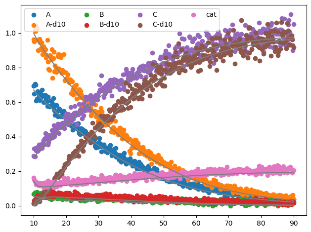

Optimize
========

To optimize the rate constants, several steps need to be performed, such as:

1. Defining the error functions
2. Creating a prediction
3. Comparing the result of the prediction with experimental data
4. Weighing of the errors
5. Saving the intermediate results
6. Repeating the 3-5 until a the error no longer improves and the rate constants have converged to a stable value or the maximum number of iterations has been reached.

The :class:`optimize.RateConstantOptimizerTemplate` is an abstract base class which has implemented most of the steps
above. However, the user must still define its error functions and the exact methodology of creating a prediction.

.. py:currentmodule:: optimize
.. class:: RateConstantOptimizerTemplate(weights, experimental, metric)

    :param weights: A dictionairy containing patterns and weight. Each pattern will be searched for in  the errors.
        Upon a match the error yielded will be multiplied by its respective weight. If a error is matched with multiple
        patterns, the weight will be decreased in a multiplicative manner. The final weights after the pattern search
        are stored in weights_array
    :type weights: dict[str, float]
    :param experimental: The experimental data.
    :type experimental: polars.DataFrame
    :param metric: An error metric which takes as input the keywords ``y_pred`` and ``y_true`` and returns a float. Lower values
        should indicate a better prediction.
    :type metric: Callable[[np.ndarray, np.ndarray], float]

    :var weights_array: *(np.ndarray)* - The weights for each error function.

    .. method::`create_prediction(x, x_description)`

        **Must be implemented by the user!** Takes a set of parameters and their respective description, and should
        output the prediction starting at the time that the labeled compound has been added.

        :param x: The parameters required for the reaction.
        :type x: np.ndarray
        :param x_description: The description of each parameter.
        :type x_description: list[str]

Example
-------
To optimize the rate constants we will analyze a simple system. We can describe the model and the experimental
conditions as follows:

.. math::

    \require{mhchem}
    \ce{catalyst + A <=>[\ce{k1}][\ce{k_{-1}}] B ->[\ce{{k2}}] C + catalyst}

.. code-block:: python

    import numpy as np

    reactions = [
        ('k1', ['A', 'cat'], ['B'],),
        ('k-1', ['B'], ['A', 'cat'],),
        ('k2', ['B'], ['C', 'cat']),

        # labeled
        ('k1', ['A-d10', 'cat'], ['B-d10'],),
        ('k-1', ['B-d10'], ['A-d10', 'cat'],),
        ('k2', ['B-d10'], ['C-d10', 'cat'])
    ]

    # experiment
    rate_constants_real = {'k1': 0.3, 'k-1': 0.05, 'k2': 0.5}
    dilution_factor = 1 / 2
    concentration_initial = {'A': 1, 'cat': 1 / 5}
    concentration_labeled = {'A-d10': 1*dilution_factor}  # same concentration as diluted unlabeled catalyst
    time_pre = np.linspace(0, 10, 50)                     # 10 minutes between the addition of the chemical and labeled chemical
    time_post = np.linspace(10, 90, 400)

To be able to fit to this hypothetical reaction fake data was generated by first creating a prediction using the :class:`DRL <predict.DRL>`
class. To this data we than add noise based on its intensity and a base level of noise to mimic real experimental data.

.. code-block:: python

    from delayed_reactant_labeling.predict import DRL
    import polars as pl  # allows us to manipulate the data very efficiently

    # create a "real" prediction.
    drl_real = DRL(rate_constants=rate_constants_real, reactions=reactions)
    real_data = drl_real.predict_concentration(
        t_eval_pre=time_pre,
        t_eval_post=time_post,
        dilution_factor=dilution_factor,
        initial_concentrations=concentration_initial,
        labeled_concentration=concentration_labeled)

    # add noise
    rng = np.random.default_rng(42)
    fake_data = []
    ax = axs[1]
    for col in real_data.columns[:-1]:  # last column contains time array, so skip that one.
        noise_dynamic = real_data[col]**0.5 * rng.normal(loc=0, scale=0.04, size=(real_data.shape[0]))  # S/N increases with sqrt(I)
        noise_static = rng.normal(loc=0, scale=0.005, size=(real_data.shape[0])) # base noise
        fake_col = real_data[col] + noise_dynamic + noise_static
        fake_col[fake_col < 1e-10] = 1e-10  # no negative intensity
        fake_data.append(fake_col)
    fake_data.append(real_data['time'])
    fake_data = pl.DataFrame(fake_data, real_data.columns)

The :class:`optimize.RateConstantOptimizerTemplate` contains several functions which allow it to optimize a model.
However, it does require the user to define two functions.The first ``create_prediction`` should tell the class how
exactly it can create a prediction, when its given certain parameters. This function allows the user also to modify the
parameters its given, or to modify the output of the prediction. The second function ``calculate_curves`` describes how
the data should be analyzed.

.. code-block:: python

    from delayed_reactant_labeling.optimize import RateConstantOptimizerTemplate
    import pandas as pd

    class RateConstantOptimizer(RateConstantOptimizerTemplate):
        @staticmethod
        def create_prediction(x: np.ndarray, x_description: list[str]) -> pl.DataFrame:
            # this is also the location where the rate constants can be manipulated easily
            # e.g. rate_constants['k1'] = 0.1, would fixate this value of k1

            rate_constants = pd.Series(x, x_description)
            drl = DRL(reactions=reactions, rate_constants=rate_constants)
            pred_labeled = drl.predict_concentration(
                t_eval_pre=time_pre,
                t_eval_post=time_post,
                initial_concentrations=concentration_initial,
                labeled_concentration=concentration_labeled,
                dilution_factor=dilution_factor,
                rtol=1e-8,
                atol=1e-8)

            # the output can also be manipulated before anything happens with it
            return pred_labeled

        @staticmethod
        def calculate_curves(data: pl.DataFrame) -> dict[str, pl.Series]:
            curves = {}
            for chemical in ['A', 'B', 'C']:
                chemical_sum = data[[chemical, f'{chemical}-d10']].sum(axis=1)
                curves[f'ratio_{chemical}'] = data[chemical] / chemical_sum
            return curves

Internally the class compares the curves of the predicted data with the experimental data using a metric function. The
function that calculates the Mean Absolute Error can for example be defined as follows:

.. code-block:: python

    def metric(y_true, y_pred):
        return np.average( np.abs(y_true - y_pred))

The ``np.average`` function also takes a weight keyword, so this can easily be implemented into the metric. Other
functions such as ``np.nanmean`` can be used to skip NaN values. ``Scikit-learn.metrics`` implements a lot of different
metrics and is a great resource. However, their functions also always check the arguments very precisely, which can
lead to significant slow-downs (~25% in some tests).

