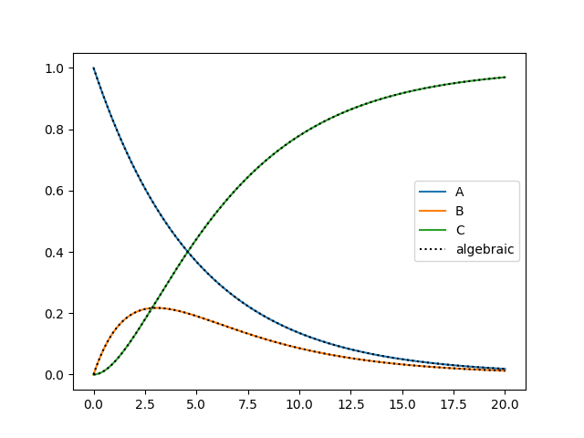
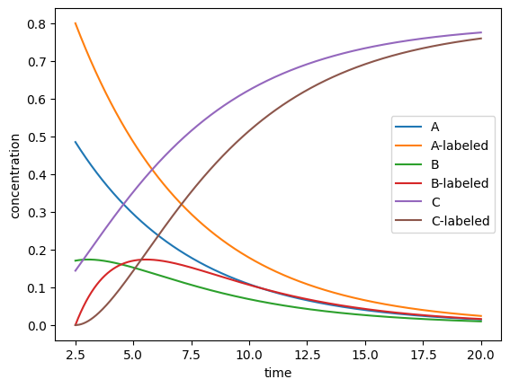

Predict
=======
The predict module implements the :class:`DRL <predict.DRL>` class which helps to create a prediction of a chemical
system. When the prediction fails it raises a :exc:`InvalidPredictionError <predict.InvalidPredictionError>`. The DRL
class implements methods to:

#. :meth:`Predict the concentrations<predict.DRL.predict_concentration>` for a DRL experiment using the ODE solver (preferred).
#. Predict the concentrations for a DRL experiment using the explicit Euler formula (discouraged).
#. Calculate the change  in chemical concentration as a function of the current concentrations.
#. Calculate the Jacobian, which is required by the ODE solver. This **only** works for reaction where each reaction step is first order in each chemical.

The details how the :ref:`rate equations<rate_equations>` and :ref:`Jacobian matrix<Jacobian>` are calculated can be
found in the implementation details section.

.. py:currentmodule:: predict

.. autoclass:: DRL
    :members:

.. _PredictExample:

example
-------
The simple chemical system:

.. math::
    A \xrightarrow{\text{k1}} B \xrightarrow{\text{k2}} C

can be modeled using the :class:`DRL <predict.DRL>` class. First the reaction scheme should be written in a code
friendly way:

.. code-block:: python

    reaction1 = ('k1', ['A'], ['B'])
    reaction2 = ('k2', ['B'], ['C'])
    reactions = [reaction1, reaction2]

Where the first element of each tuple is the name of the corresponding rate constant, the second element is a list
containing all reactants, and the third element is a list containing all the products. If for example B split into C and
byproduct D, we could write the reaction2 as ``reaction2 = ('k2', ['B'], ['C', 'D'])``

Lets assume that we know the rate constants belonging to this reaction.

.. code-block:: python

    rate_constants = {
        "k1": 0.2,
        "k2": 0.5,
    }

We can create a prediction using the :func:`DRL.predict_concentration`. The class implements the method which determines
the rate of change as a function of its current state, and a method which calculate the Jacobian based on its state.
Because we do not want to model an entire DRL experiment, ``solve_ivp`` is used instead of :func:`DRL.predict_concentration`.
Internally, this function also calls ``solve_ivp``.

.. code-block:: python

    import numpy as np
    from scipy.integrate import solve_ivp
    from delayed_reactant_labeling.predict import DRL

    time = np.linspace(0, 20, num=2000)  # desire predictions at these timestamps
    k1, k2 = rate_constants['k1'], rate_constants['k2']
    A0 = 1

    drl = DRL(rate_constants=rate_constants, reactions=reactions, output_order=['A', 'B', 'C'], verbose=False)
    result = solve_ivp(
        drl.calculate_step,
        t_span=[time[0], time[-1]],
        y0=[A0, 0, 0],
        method='Radau',
        t_eval=time,
        jac=drl.calculate_jac)

However, also algebraic `solutions <https://chem.libretexts.org/Bookshelves/Physical_and_Theoretical_Chemistry_Textbook_Maps/Mathematical_Methods_in_Chemistry_(Levitus)/04%3A_First_Order_Ordinary_Differential_Equations/4.03%3A_Chemical_Kinetics>`_
for this specific chemical problem exist.

.. math::
   :nowrap:

    \begin{eqnarray}
    [A]_t = [A]_0 \cdot e^{-k_1t}
    \end{eqnarray}
    \begin{eqnarray}
    [B]_t = \frac{k_1}{k_2-k_1}[A]_0(e^{-k_1t}-e^{-k_2t})
    \end{eqnarray}
    \begin{eqnarray}
    [C]_t = A_0[1-e^{-k_1t}-\frac{k_1}{k_2-k_1}(e^{-k_1t}-e^{-k_2t})]
    \end{eqnarray}

We can compare the algebraic solution to the modelled prediction as follows.

.. code-block:: python

    import matplotlib.pyplot as plt
    kinetic_A = A0 * np.exp(-k1 * time)
    kinetic_B = k1 / (k2 - k1) * A0 * (np.exp(-k1 * time) - np.exp(-k2 * time))
    kinetic_C = A0 * (1 - np.exp(-k1 * time) - k1 / (k2 - k1) * (np.exp(-k1 * time) - np.exp(-k2 * time)))

    fig, ax = plt.subplots()
    ax.plot(time, result.y[0] / A0, label='A')
    ax.plot(time, result.y[1] / A0, label='B')
    ax.plot(time, result.y[2] / A0, label='C')
    ax.plot(time, kinetic_A, color='k', linestyle=':', label='algebraic')
    ax.plot(time, kinetic_B, color='k', linestyle=':')
    ax.plot(time, kinetic_C, color='k', linestyle=':')
    ax.legend()
    fig.show()

It is clear that the model fits the data very well, and its much easier to implement these few lines of code, instead of
doing the mathematics. Furthermore, implementing more difficult problems only requires the addition of a few lines here,
whereas solving the problem in an exact manner becomes impossible.

This current system can also be converted to a DRL experiment by adding a labeled reactant A at a certain timestamp.
This labeled reactant reacts in a identical manner to A, except that the corresponding products are also labeled.
It could be implemented as follows:

.. code-block:: python

    reaction3 = ('k1', ['A-labeled'], ['B-labeled'])
    reaction4 = ('k2', ['B-labeled'], ['C-labeled'])
    reactions.extend([reaction3, reaction4])

    drl = DRL(reactions=reactions, rate_constants=rate_constants)
    prediction = drl.predict_concentration(
        t_eval_pre=np.linspace(0, 2.5, 2500),
        t_eval_post=np.linspace(2.5, 20, 17500),
        initial_concentrations={"A": 1},
        labeled_concentration={"A-labeled": 0.8},
        dilution_factor=0.8
    )
    ax = prediction.plot('time')
    ax.set_xlabel("time")
    ax.set_ylabel("concentration")
    ax.figure.show()

